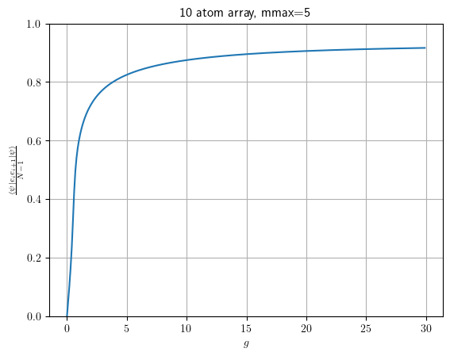
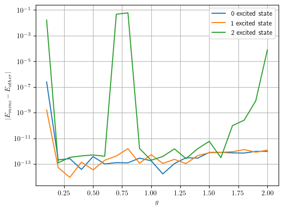
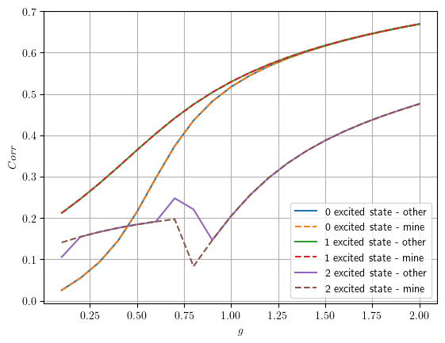
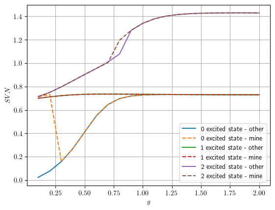
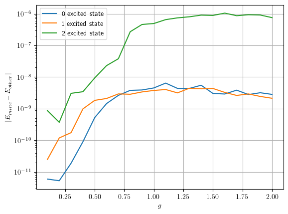
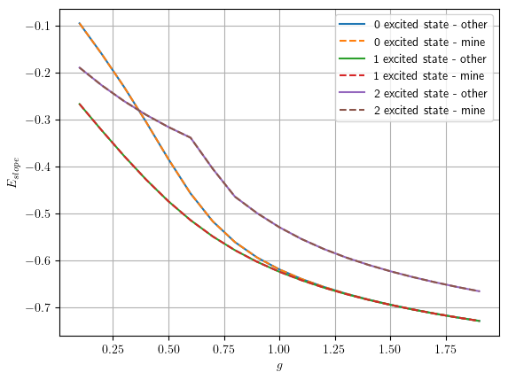
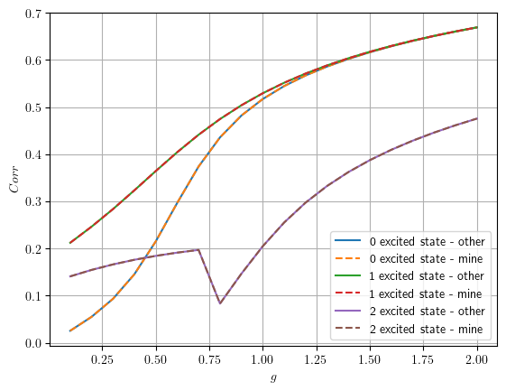
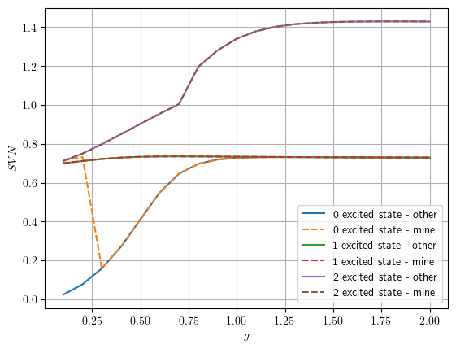
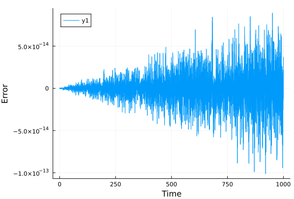

# Week 2 notes

Some papers to read are the following (not necessarily relevant)
1. [Optimized basis sets for DMRG calculations of quantum chains of
rotating water molecules](https://arxiv.org/pdf/2304.09410.pdf)
2. [Quantum Phase Transition in the One-Dimensional Water Chain](https://journals.aps.org/prl/pdf/10.1103/PhysRevLett.130.026201)
3. [Quantum Criticality and Universal Behavior in Molecular Dipolar Lattices of Endofullerenes](https://arxiv.org/pdf/2304.09404.pdf)
4. [Reconstructing quantum molecular rotor ground states](https://arxiv.org/pdf/2003.14273.pdf)

I recall that when I learned about dmrg, I also learned about TDVP (time-dependent variational principle). When I learned this, they talked about TEBD (time-evolving block decimation). There is a paper that compares them [here](https://arxiv.org/pdf/1906.09077.pdf). In the case that they look at (chain geometry), they find that TEBD outperforms TDVP by being faster for the same accuracy.

## MPS and MPO theory

An MPS represents a state with $N$ qudits of the following form, where $T^{s_1\cdots s_N}$ is a tensor with $N$ indices with dimension $d$. The total number of elements in the tensor is $d^N$. On the other hand, each tensor $A^{s_i}_{\alpha_i\alpha_{i+1}}$ has $dm^2$ elements (a tensor of shape $d\times m\times m$) (except the side ones which have $dm$ elements), for a total of $Ndm^2$ elements. This is only an exact representation when $m=d^{N/2}$.
$$\sum_{\{s_i\}} T^{s_1s_2\cdots s_N}|s_1s_2\cdots s_N\rangle =\sum_{\{s_i\}\{\alpha_i\}} A^{s_1}_{\alpha_1}A^{s_2}_{\alpha_1\alpha_2}A^{s_3}_{\alpha_2\alpha_3}\cdots A^{s_{N-1}}_{\alpha_{N-1}\alpha_N}A^{s_N}_{\alpha_N}|s_1s_2\cdots s_N\rangle $$

This is typically represented in a tensor diagram, where each tensor is a node. Lines between nodes are summed over and protruding lines are spare indices.

An MPO is a matrix product state version of an operator, required when DMRG is used. MPOs are products of operators, which result in the full operator, though here no approximations are needed.

$$\mathcal{H}=\sum^N_{i=1}S^z_iS^z_{i+1}=\mathcal{H}^{\sigma_1'\sigma_1}_{a_1}\mathcal{H}^{\sigma_2'\sigma_2}_{a_1a_2}\cdots\mathcal{H}^{\sigma_3'\sigma_3}_{a_2}$$
where $\mathcal{H}^{\sigma_i\sigma_{i}}_{a_ia_{i+1}}$ is a $k\times k$ tensor (or $k$ length vector) composed of operators, where each operator has shape $m\times m$.

# Goals

1. Using python or Julia, using Krylov compute the exact diagonalization of the system in the normal basis (not DVR). For N=6, try getting over 100 eigenvalues.
1. Use dmrg on the same system size to compute the same observables. Compare ED with dmrg to make sure that they are giving the same results
1. Benchmark dmrg on different system sizes 

# Exact diagonalization notes

I wanted to test out Krylov for exact diagonalization on python and julia to see which is faster and consumes less memory. I tried diagonalizing a 2000x2000 simple matrix with julia and python and found that julia diagonalizes it significantly faster (0.29s vs 30s).

It seems julia is considerably faster for this computational work. And it turns out that when computing Krylov, julia permits you to input a function rather than a sparse matrix allowing the computation to possibly be even faster. As such I will be using Julia for all the computation.

|Language| matrix size | Eigenvalues| computation time    | Memory usage | Multiplication type
|-----------|-------------|-|---------------|--------------|------------
| Julia     | 1000x1000   |20|0.29s        | 51MiB| tridiagonal
| Julia     | 2000x2000   |20|0.34s        | 74MiB| tridiagonal
|Julia      | 4000x4000   |20| 0.42s       | 121Mib| tridiagonal
|Julia      | 4000x4000   |20| 0.47s       | 121Mib| fully sparse
|Julia      | 4000x4000   |20| 6.56s       | 243Mib| full random

After implementing exact diagonalization (using a function instead of a sparse matrix), I'm trying to do some sanity checks on it to make sure it gives correct results. The sanity checks I tried were

* Eigenvalues should be real
* When removing everything except for the diagonal terms of the Hamiltonian (the kinetic energy), the eigenvalues should be integers ranging 0 to the number of sites.

I tried the second test out with a bunch of different numbers of sites. 
| Number of sites | Lowest energy eigenvalue (32 bit)| Lowest energy eigenvalue (64 bit)
|-----------------|--------------------------|----------------------------------------|
|4                | -3.1296242f-8 + 0.0f0im  |
|6                | -8.374532f-7 + 0.0f0im   |
|8                | -5.269335f-6 + 0.0f0im   |
|9                | -3.072994f-5 + 0.0f0im   | -1.1665844432529177e-15
|10               | -0.36557737f0 + 3.0756624f-9im| -6.204821236776984e-16
|11               | -0.00017834675f0 + 0.0f0im|
|12               | -0.44316366f0 - 1.4922666f-8im|
|13               | -0.47128f0 - 1.5985069f-7im |
|14               | -0.47128f0 - 1.5985069f-7im | 1.0877254197493817e-15

This obviously shows that we should be using the ComplexF64 data type as suppose to the ComplexF32.

I will also benchmark the time required to compute 20 eigenvalues of the full Hamiltonian

| Number of sites | Runtime | Compilation time| Memory usage | $g$ | $E_{strength}$| mmax | Ground state energy|
|-----------------|---------|-----|---------------|-----|---------------|------|---|
| 4               |2.767717 s|99.41%|43.727 MiB|1|0|1|-1.771|
| 5               |2.812142 s|96.37%|54.642 MiB|1|0|1|-2.4904099|
| 6               |2.827059 s|95.53%|48.314 MiB|1|0|1|-3.2327693|
| 8               |6.391806 s|42.90%|144.878 MiB|1|0|1|-4.7493|
| 9               |23.648487 s|11.52%|505.728 MiB|1|0|1|-5.5145183|
| 10              |52.326709 s|5.04% |1.456 GiB|1|0|1|-6.2819474|
| 11              |189.948654 s| 1.40%|  4.603 GiB|1|0|1|-7.050740655526397|

| Number of sites | Runtime | Compilation time| Memory usage | $g$ | $E_{strength}$| mmax | Ground state energy|Pairing|
|-----------------|---------|-----|---------------|-----|---------------|------|---|---|
| 10               |2.487211 s| 87.88%|81.666 MiB|0|0|1|-6.2048212e-16|Full|
| 10               |34.333341 s|7.89%|811.842 MiB|0.1|0|1|-0.0585|Full|
| 10               |38.668293 s|7.26%|947.592 MiB|0.2|0|1|-0.2412|Full|
| 10               |46.222440 s|5.50%|1.219 GiB|0.3|0|1|-0.5623|Full|
| 10               ||||1|0|1|-5.04440788|Nearest|

I figured out that I was noticing a difference between the dmrg and ED because with ED, I was computing all interactions as supposed to just nearest neighbours. Once this was corrected, the values agree (for small mmax since those are tractible with ED) to 7 (notably not all) decimal places. The decimal places in parenthesis are the numbers that are different.

* ED: -0.05618757(7289309135) vs DMRG: -0.05618757(058327395)
* ED: -5.044407(884621901) vs DMRG: -5.044407(649444798)

It seems the total correlation $\sum_i\langle|\psi|e_i e_{i+1}|\psi\rangle$ converges to around 8.37 as $g\rightarrow \infty$ (using $g\sim 10^7$).

## Benchmarking SVD

| Nsites | mmax | time | allocations | memory |Method |
|--------|------|------|-------------|--------|-------|
|6       | 1    |0.000056s | 55       |71.016 KiB| Krylov |
|6       | 1    |0.000077s| 8       |38.734 KiB| LinAlg |
|6       | 2    |0.000997s | 91    |1.006 MiB| Krylov |
|6       | 2    |0.002080s |  11   |739.812 KiB| LinAlg |
|6       | 3    |0.004435s | 400    |2.370 MiB| Krylov |
|6       | 3    |0.015207s |  12   |5.549 MiB| LinAlg |
|6       | 4    |0.010361s | 440    |7.872 MiB| Krylov |
|6       | 4    |0.069506s |  12   |24.716 MiB| LinAlg |

# Benchmarking difference between DMRG and ED

Now that I've gotten dmrg and ed working with all the metrics that I care about and the proper means of saving data, I can perform extensive runs. 

I've found that the runtime of dmrg is highly dependent on the maxlinkdim parameter, since it will start on a high bond dimension, taking a long time, and then get to the proper bond dimension which is considerably lower. There is an option to make the initial bond dimension more automatic, using observers, except it seems like the energy convergence isn't as good. Thus I will keep a manual constant initial bond dimension, making sure that it isn't much higher than the bond length which it will converge to.

For my benchmarking, I will test out the following sets of parameters

* mmax=1..5
* Nsites=6..10
* g=1

# Comparison with Henrik Larsson data
When I compare my exact ED data to his exact data, I see some artifacts of sort around $g=0.75$ for the second excited state, in both energy, correlation and entropy. 

When I compare my ED to the ttns data, I get total agreement. Excet for the ground state entropy.

I later figured out that the reason for the weirdness in the plots is that there is an energy level crossing at $g=0.75$ for the third and a higher energy level. 

# ED Parity
I found an even and odd projection operator in order to find the parity of energy eigenvectors. By parity, I mean under reflection symmetry.

$$P_{even}=\frac{1}{2}(|abcde\rangle +  |edcba\rangle)(\langle abcde| +  \langle edcba|) +\cdots + |abcba\rangle\langle abcba | +\cdots $$
$$P_{odd}=\frac{1}{2}(|abcde\rangle -  |edcba\rangle)(\langle abcde| - \langle edcba|) +\cdots $$

Upon writing this as an operator acting on my state, I found that (at least in the cases I've tried), the ground state and first excited state are even and the third and fourth excited state are odd. For sufficiently high $mmax$, the parity will swap every $n$ or every other $n$.

$mmax=2$  and $Nsites=6$
|n | $\langle E_n \|P_{reflection-even}\|E_n\rangle$ | $\langle E_n \|P_{inversion-even}\|E_n\rangle$
|--|----|-----|
| 0 | 1   | 1|
| 1 | 1   |1 |
| 2 | 0   |1 |
| 3 | 0   |0 |
| 4 | 1   |0 |
| 5 | 1   |1 |
| 6 | 0   |0|
| 7 | 1   |0 |
| 8 | 0   |1 |
| 9 | 0   | 0 |
| 10 | 1   | 0|
| 11 | 1   |1|
| 12 | 0   |1|
| 13 | 1   |1|
| 14 | 0   |0|
| 15 | 1   |0|
| 16 | 0   |1|
| 17 | 1   |0|
| 18 | 1   |0|
| 19 | 1   |1 |

# Comparing TTN to MPS
I compared the performance of TTN from ITensorNetworks.jl to MPS from ITensors on a large 1d ising model. 

I found that the dmrg for TTN and MPS are quite comparable in duration, however it takes significantly longer to initialize the Hamiltonian TTL than the MPO (it scales worse). So I think it's better to use MPS rather than TTN. 

However, I find that for the really complicated ising models (with more than nearest neighbours interaction), MPS and TTN dmrg give different answers for the ground state energy.

# More benchmarking

I was running dmrg to compute the ground state for a bunch of $N$ and $mmax$ values. We wanted to look at varying $N$ while keeping $mmax$ constant (maybe also keeping bond dimension constant). As well, keeping $N$ constant while varying $mmax$. We care about the time to run each of these and all the other information present there.

When testing this, I found that in the present code, when running DMRG for increasing $g$ values, the bond dimension gets fixed. Around the critical point, DMRG takes a while, but after it DMRG shouldn't take too long. But because the bond dimension gets fixed, DMRG on the $g$ values after the critical point use a higher bond dimension that needed, making it take longer. So when I iterated over many $g$ values, the bond dimension was higher after the critical point than if I just started afterward. 

If we keep the bond dimension at a reasonable value, DMRG won't take a long time even for very large system sizes. And typically, we will have a reasonable value when it is allowed to change. Though if the bond dimension is extra high, you will spend extra time doing computation, but you will obtain a more accurate result.

Compared to when I tested over many $g$ values.

Upon doing this experiment, I observed a few things. By the time we reach 1000 atoms, we have reached thermalization. The bond energy and von neumann entropy have converged.

# Symmetries of the system

For some transformation $\hat{\pi}$ on the state $|\psi\rangle$, it corresponds to a symmetry of the Hamiltonian (as supposed to the symmetry of a state) if

$$[\hat{H},\hat{\pi}]=0\Rightarrow \hat{\pi}^\dag\hat{H}\hat{\pi}=\hat{H}$$

Then for an eigenvalue of $\hat{H}$, the eigenstate $|E_n\rangle$ is also an eigenstate of the transform, $\hat{\pi}|E_{\theta,n}\rangle=e^{i\theta}|E_{\theta,n}\rangle$. Due to $[\hat{H},\hat{\pi}]=0$, for some state $|\psi(t)\rangle$, $e^{i\theta}$ is conserved. 

But happens if we change $g$? If $[\hat{H}_g,\hat{\pi}]=0$, then $|E_g\rangle$ maintains a symmetry in $\hat{\pi}$ for any $g$. Though, the eigenvalue may change continuously.

$$\frac{\partial}{\partial g}\langle E_{\theta,g}|\hat{\pi}|E_{\theta,g}\rangle=\left(\frac{\partial}{\partial g}\langle E_{\theta,g}|\right)\hat{\pi}|E_{\theta,g}\rangle+(\langle E_{\theta,g}|\hat{\pi})\left(\frac{\partial}{\partial g}|E_{\theta,g}\rangle\right)=e^{i\theta(g)}\left(\frac{\partial}{\partial g}\langle E_{\theta,g}|E_{\theta,g}\rangle\right)=0$$
Thus the eigenvalue of $\hat{\pi}$ is independent of $g$.

|Property | Transformation |
|-------------------------------|-|
|$\sum_i m_i=\text{odd or even}$| |
||$\forall i: m_i\rightarrow -m_i$ |
||$\forall i: m_i\rightarrow m_{N-i}$ |

# Phase transition analysis

Quantum phase transitions are phase transitions which occur at $T=0$. The sdhmidt gap detects the critical point well and scales with the universal critical exponents.

With the ED data, the energy levels are sorted, even if they cross. So something I will want to do is unsort the energy levels to see how they change in time (despite crossing). 

I also notice that there are three regions that seem to arise for $g\rightarrow 0$ (the third point is the ground state) (at least up to the first 20 energy levels). I would hypothesize at $g=0$, these converge to three points.

Another thing that we can observe is energy levels wich combine for high $g$ values. When we measure the difference between energy levels, I find that around half of them increase as $g$ increases, and the other half steadily decrease to zero (with exponential decay). The plot of these energy differences as a function of $g$, taking only the ones that eventually go down look like this:

We find that each of the higher energy levels of the pairs are even. There's a possibility that this is due to the energy levels being sorted, but that's not guaranteed. 

The way that I ultimately resolved this was by Pierre's suggestion, states that are similar should have a $\langle E_{n,g} | E_{n,g+\delta}\rangle$ close to 1. So, for the ED, I was able to sort through this by computing the energy level which maximizes this inner product of the previous $g$ value. However, there are still some annoyances, for instance, in the case where an energy level vanishes since it doesn't have the $n$ th lowest energy, we have to truncate the curve early. The opposite can be true, in which an energy level arises from no where. I decided to ignore these from the curve. 

There seems to be something weird happening with the 10th and 18th energy level. Every other one looks normal (for SvN (at least after a point), correlation and energy) except those. For the energy graph, they cross each other twice, remaining reasonably close to each other everywhere between.

In the plots, I have labelled inversion symmetry with the colour (black for odd and red for even), and the line style for reflection symmetry (dashed for even and solid for odd).