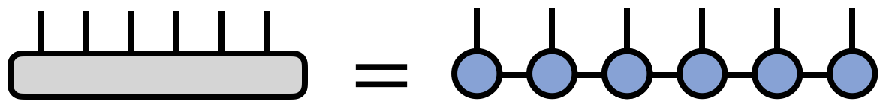
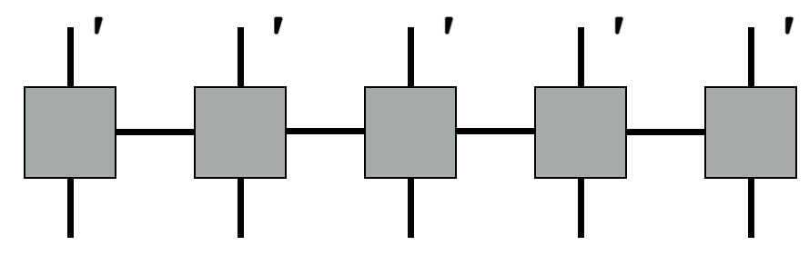

# Week 2 notes

Some papers to read are the following (not necessarily relevant)
1. [Optimized basis sets for DMRG calculations of quantum chains of
rotating water molecules](https://arxiv.org/pdf/2304.09410.pdf)
2. [Quantum Phase Transition in the One-Dimensional Water Chain](https://journals.aps.org/prl/pdf/10.1103/PhysRevLett.130.026201)
3. [Quantum Criticality and Universal Behavior in Molecular Dipolar Lattices of Endofullerenes](https://arxiv.org/pdf/2304.09404.pdf)
4. [Reconstructing quantum molecular rotor ground states](https://arxiv.org/pdf/2003.14273.pdf)

I recall that when I learned about dmrg, I also learned about TDVP (time-dependent variational principle). When I learned this, they talked about TEBD (time-evolving block decimation). There is a paper that compares them [here](https://arxiv.org/pdf/1906.09077.pdf). In the case that they look at (chain geometry), they find that TEBD outperforms TDVP by being faster for the same accuracy.

## MPS and MPO theory

An MPS represents a state with $N$ qudits of the following form, where $T^{s_1\cdots s_N}$ is a tensor with $N$ indices with dimension $d$. The total number of elements in the tensor is $d^N$. On the other hand, each tensor $A^{s_i}_{\alpha_i\alpha_{i+1}}$ has $dm^2$ elements (a tensor of shape $d\times m\times m$) (except the side ones which have $dm$ elements), for a total of $Ndm^2$ elements. This is only an exact representation when $m=d^{N/2}$.
$$\sum_{\{s_i\}} T^{s_1s_2\cdots s_N}|s_1s_2\cdots s_N\rangle =\sum_{\{s_i\}\{\alpha_i\}} A^{s_1}_{\alpha_1}A^{s_2}_{\alpha_1\alpha_2}A^{s_3}_{\alpha_2\alpha_3}\cdots A^{s_{N-1}}_{\alpha_{N-1}\alpha_N}A^{s_N}_{\alpha_N}|s_1s_2\cdots s_N\rangle $$

This is typically represented in a tensor diagram, where each tensor is a node. Lines between nodes are summed over and protruding lines are spare indices.

An MPO is a matrix product state version of an operator, required when DMRG is used. MPOs are products of operators, which result in the full operator, though here no approximations are needed.

$$\mathcal{H}=\sum^N_{i=1}S^z_iS^z_{i+1}=\mathcal{H}^{\sigma_1'\sigma_1}_{a_1}\mathcal{H}^{\sigma_2'\sigma_2}_{a_1a_2}\cdots\mathcal{H}^{\sigma_3'\sigma_3}_{a_2}$$
where $\mathcal{H}^{\sigma_i\sigma_{i}}_{a_ia_{i+1}}$ is a $k\times k$ tensor (or $k$ length vector) composed of operators, where each operator has shape $m\times m$.

## Code overview

### DMRG

1. Initialize matrices and parameters
1. Run DMRG on non-interacting rots as initial guess. $\mathcal{H}=E\sum \cos(\theta) S^x_j+\sin(\theta) S^y_j $