# Week 2 notes

Some papers to read are the following (not necessarily relevant)
1. [Optimized basis sets for DMRG calculations of quantum chains of
rotating water molecules](https://arxiv.org/pdf/2304.09410.pdf)
2. [Quantum Phase Transition in the One-Dimensional Water Chain](https://journals.aps.org/prl/pdf/10.1103/PhysRevLett.130.026201)
3. [Quantum Criticality and Universal Behavior in Molecular Dipolar Lattices of Endofullerenes](https://arxiv.org/pdf/2304.09404.pdf)
4. [Reconstructing quantum molecular rotor ground states](https://arxiv.org/pdf/2003.14273.pdf)

I recall that when I learned about dmrg, I also learned about TDVP (time-dependent variational principle). When I learned this, they talked about TEBD (time-evolving block decimation). There is a paper that compares them [here](https://arxiv.org/pdf/1906.09077.pdf). In the case that they look at (chain geometry), they find that TEBD outperforms TDVP by being faster for the same accuracy.

## MPS and MPO theory

An MPS represents a state with $N$ qudits of the following form, where $T^{s_1\cdots s_N}$ is a tensor with $N$ indices with dimension $d$. The total number of elements in the tensor is $d^N$. On the other hand, each tensor $A^{s_i}_{\alpha_i\alpha_{i+1}}$ has $dm^2$ elements (a tensor of shape $d\times m\times m$) (except the side ones which have $dm$ elements), for a total of $Ndm^2$ elements. This is only an exact representation when $m=d^{N/2}$.
$$\sum_{\{s_i\}} T^{s_1s_2\cdots s_N}|s_1s_2\cdots s_N\rangle =\sum_{\{s_i\}\{\alpha_i\}} A^{s_1}_{\alpha_1}A^{s_2}_{\alpha_1\alpha_2}A^{s_3}_{\alpha_2\alpha_3}\cdots A^{s_{N-1}}_{\alpha_{N-1}\alpha_N}A^{s_N}_{\alpha_N}|s_1s_2\cdots s_N\rangle $$

This is typically represented in a tensor diagram, where each tensor is a node. Lines between nodes are summed over and protruding lines are spare indices.

An MPO is a matrix product state version of an operator, required when DMRG is used. MPOs are products of operators, which result in the full operator, though here no approximations are needed.

$$\mathcal{H}=\sum^N_{i=1}S^z_iS^z_{i+1}=\mathcal{H}^{\sigma_1'\sigma_1}_{a_1}\mathcal{H}^{\sigma_2'\sigma_2}_{a_1a_2}\cdots\mathcal{H}^{\sigma_3'\sigma_3}_{a_2}$$
where $\mathcal{H}^{\sigma_i\sigma_{i}}_{a_ia_{i+1}}$ is a $k\times k$ tensor (or $k$ length vector) composed of operators, where each operator has shape $m\times m$.

# Goals

1. Using python or Julia, using Krylov compute the exact diagonalization of the system in the normal basis (not DVR). For N=6, try getting over 100 eigenvalues.
1. Use dmrg on the same system size to compute the same observables. Compare ED with dmrg to make sure that they are giving the same results
1. Benchmark dmrg on different system sizes 

# Exact diagonalization notes

I wanted to test out Krylov for exact diagonalization on python and julia to see which is faster and consumes less memory. I tried diagonalizing a 2000x2000 simple matrix with julia and python and found that julia diagonalizes it significantly faster (0.29s vs 30s).

It seems julia is considerably faster for this computational work. And it turns out that when computing Krylov, julia permits you to input a function rather than a sparse matrix allowing the computation to possibly be even faster. As such I will be using Julia for all the computation.

|Language| matrix size | Eigenvalues| computation time    | Memory usage | Multiplication type
|-----------|-------------|-|---------------|--------------|------------
| Julia     | 1000x1000   |20|0.29s        | 51MiB| tridiagonal
| Julia     | 2000x2000   |20|0.34s        | 74MiB| tridiagonal
|Julia      | 4000x4000   |20| 0.42s       | 121Mib| tridiagonal
|Julia      | 4000x4000   |20| 0.47s       | 121Mib| fully sparse
|Julia      | 4000x4000   |20| 6.56s       | 243Mib| full random

After implementing exact diagonalization (using a function instead of a sparse matrix), I'm trying to do some sanity checks on it to make sure it gives correct results. The sanity checks I tried were

* Eigenvalues should be real
* When removing everything except for the diagonal terms of the Hamiltonian (the kinetic energy), the eigenvalues should be integers ranging 0 to the number of sites.

I tried the second test out with a bunch of different numbers of sites. 
| Number of sites | Lowest energy eigenvalue (32 bit)| Lowest energy eigenvalue (64 bit)
|-----------------|--------------------------|----------------------------------------|
|4                | -3.1296242f-8 + 0.0f0im  |
|6                | -8.374532f-7 + 0.0f0im   |
|8                | -5.269335f-6 + 0.0f0im   |
|9                | -3.072994f-5 + 0.0f0im   | -1.1665844432529177e-15
|10               | -0.36557737f0 + 3.0756624f-9im| -6.204821236776984e-16
|11               | -0.00017834675f0 + 0.0f0im|
|12               | -0.44316366f0 - 1.4922666f-8im|
|13               | -0.47128f0 - 1.5985069f-7im |
|14               | -0.47128f0 - 1.5985069f-7im | 1.0877254197493817e-15

This obviously shows that we should be using the ComplexF64 data type as suppose to the ComplexF32.

I will also benchmark the time required to compute 20 eigenvalues of the full Hamiltonian

| Number of sites | Runtime | Compilation time| Memory usage | $g$ | $E_{strength}$| mmax | Ground state energy|
|-----------------|---------|-----|---------------|-----|---------------|------|---|
| 4               |2.767717 s|99.41%|43.727 MiB|1|0|1|-1.771|
| 5               |2.812142 s|96.37%|54.642 MiB|1|0|1|-2.4904099|
| 6               |2.827059 s|95.53%|48.314 MiB|1|0|1|-3.2327693|
| 8               |6.391806 s|42.90%|144.878 MiB|1|0|1|-4.7493|
| 9               |23.648487 s|11.52%|505.728 MiB|1|0|1|-5.5145183|
| 10              |52.326709 s|5.04% |1.456 GiB|1|0|1|-6.2819474|
| 11              |189.948654 s| 1.40%|  4.603 GiB|1|0|1|-7.050740655526397|

| Number of sites | Runtime | Compilation time| Memory usage | $g$ | $E_{strength}$| mmax | Ground state energy|Pairing|
|-----------------|---------|-----|---------------|-----|---------------|------|---|---|
| 10               |2.487211 s| 87.88%|81.666 MiB|0|0|1|-6.2048212e-16|Full|
| 10               |34.333341 s|7.89%|811.842 MiB|0.1|0|1|-0.0585|Full|
| 10               |38.668293 s|7.26%|947.592 MiB|0.2|0|1|-0.2412|Full|
| 10               |46.222440 s|5.50%|1.219 GiB|0.3|0|1|-0.5623|Full|
| 10               ||||1|0|1|-5.04440788|Nearest|

I figured out that I was noticing a difference between the dmrg and ED because with ED, I was computing all interactions as supposed to just nearest neighbours. Once this was corrected, the values agree (for small mmax since those are tractible with ED) to 7 (notably not all) decimal places. The decimal places in parenthesis are the numbers that are different.

* ED: -0.05618757(7289309135) vs DMRG: -0.05618757(058327395)
* ED: -5.044407(884621901) vs DMRG: -5.044407(649444798)

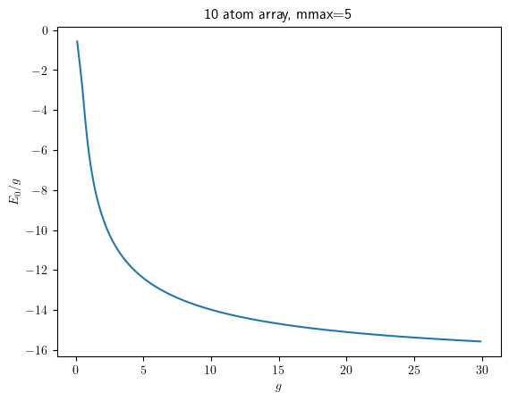

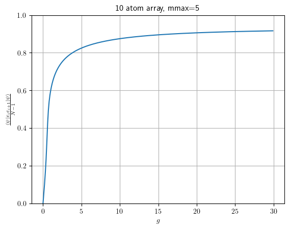

It seems the total correlation $\sum_i\langle|\psi|e_i e_{i+1}|\psi\rangle$ converges to around 8.37 as $g\rightarrow \infty$ (using $g\sim 10^7$).

## Benchmarking SVD

| Nsites | mmax | time | allocations | memory |Method |
|--------|------|------|-------------|--------|-------|
|6       | 1    |0.000056s | 55       |71.016 KiB| Krylov |
|6       | 1    |0.000077s| 8       |38.734 KiB| LinAlg |
|6       | 2    |0.000997s | 91    |1.006 MiB| Krylov |
|6       | 2    |0.002080s |  11   |739.812 KiB| LinAlg |
|6       | 3    |0.004435s | 400    |2.370 MiB| Krylov |
|6       | 3    |0.015207s |  12   |5.549 MiB| LinAlg |
|6       | 4    |0.010361s | 440    |7.872 MiB| Krylov |
|6       | 4    |0.069506s |  12   |24.716 MiB| LinAlg |

# Benchmarking difference between DMRG and ED

Now that I've gotten dmrg and ed working with all the metrics that I care about and the proper means of saving data, I can perform extensive runs. 

I've found that the runtime of dmrg is highly dependent on the maxlinkdim parameter, since it will start on a high bond dimension, taking a long time, and then get to the proper bond dimension which is considerably lower. There is an option to make the initial bond dimension more automatic, using observers, except it seems like the energy convergence isn't as good. Thus I will keep a manual constant initial bond dimension, making sure that it isn't much higher than the bond length which it will converge to.

For my benchmarking, I will test out the following sets of parameters

* mmax=1..5
* Nsites=6..10
* g=1

# Comparison with Henrik Larsson data
When I compare my exact ED data to his exact data, I see some artifacts of sort around $g=0.75$ for the second excited state, in both energy, correlation and entropy. 

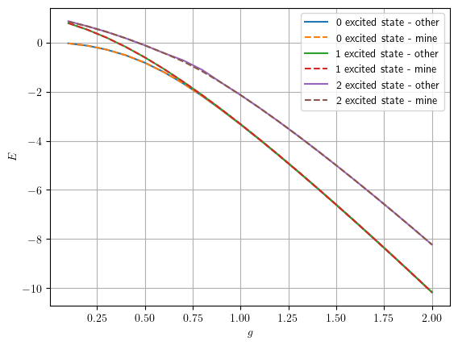

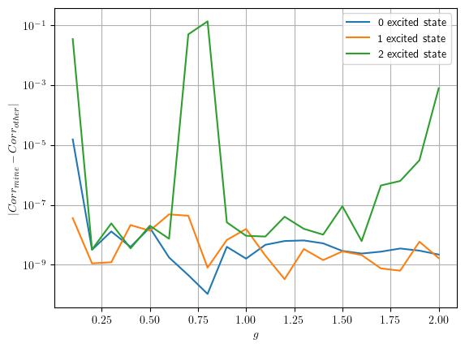
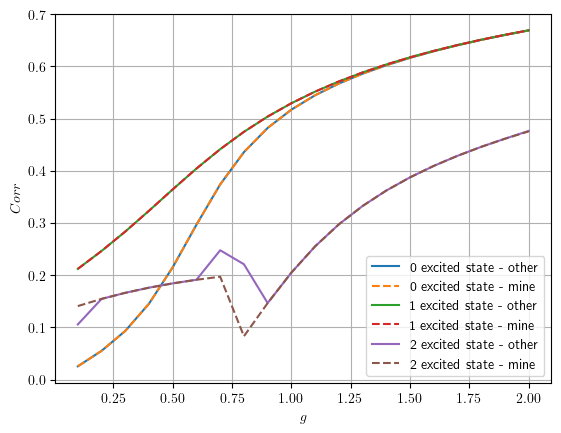

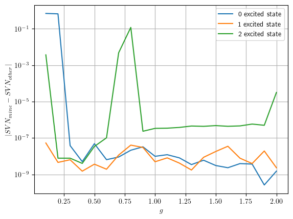
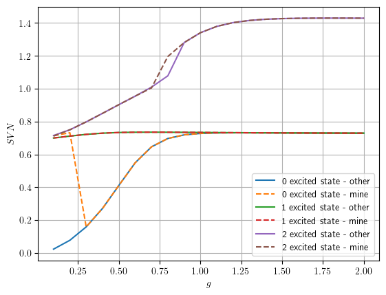

When I compare my ED to the ttns data, I get total agreement. Excet for the ground state entropy.

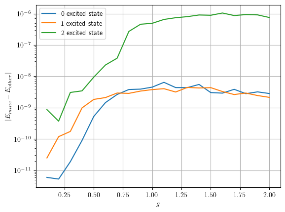

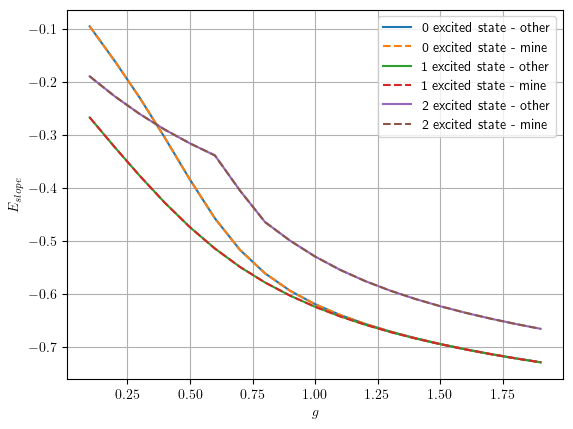

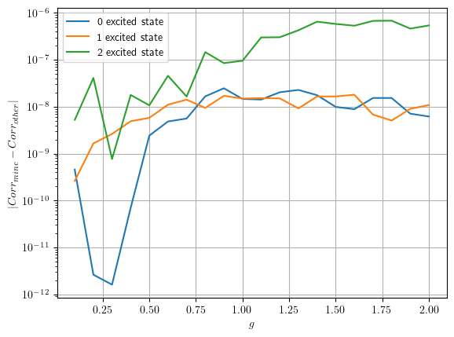
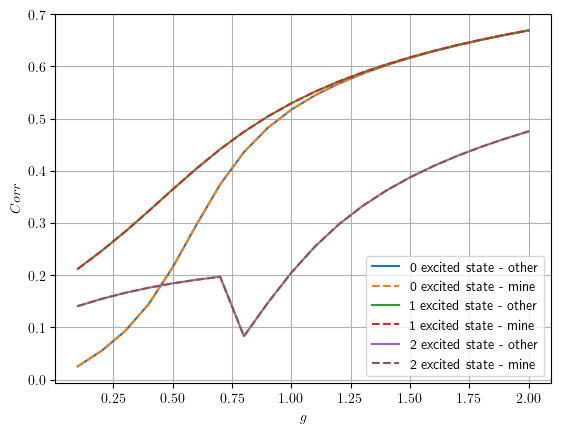

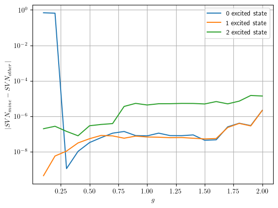
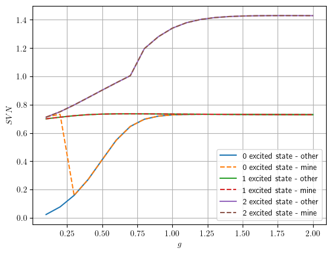

# ED Parity
I found an even and odd projection operator in order to find the parity of energy eigenvectors. By parity, I mean under reflection symmetry.

$$P_{even}=\frac{1}{2}(|abcde\rangle +  |edcba\rangle)(\langle abcde| +  \langle edcba|) +\cdots + |abcba\rangle\langle abcba | +\cdots $$
$$P_{odd}=\frac{1}{2}(|abcde\rangle -  |edcba\rangle)(\langle abcde| - \langle edcba|) +\cdots $$

Upon writing this as an operator acting on my state, I found that (at least in the cases I've tried), the ground state and first excited state are even and the third and fourth excited state are odd. For sufficiently high $mmax$, the parity will swap every $n$ or every other $n$.

$mmax=2$  and $Nsites=6$
|n | $\langle E_n \|P_{reflection-even}\|E_n\rangle$ | $\langle E_n \|P_{inversion-even}\|E_n\rangle$
|--|----|-----|
| 0 | 1   | 1|
| 1 | 1   |1 |
| 2 | 0   |1 |
| 3 | 0   |0 |
| 4 | 1   |0 |
| 5 | 1   |1 |
| 6 | 0   |0|
| 7 | 1   |0 |
| 8 | 0   |1 |
| 9 | 0   | 0 |
| 10 | 1   | 0|
| 11 | 1   |1|
| 12 | 0   |1|
| 13 | 1   |1|
| 14 | 0   |0|
| 15 | 1   |0|
| 16 | 0   |1|
| 17 | 1   |0|
| 18 | 1   |0|
| 19 | 1   |1 |

# Comparing TTN to MPS
I compared the performance of TTN from ITensorNetworks.jl to MPS from ITensors on a large 1d ising model. 

I found that the dmrg for TTN and MPS are quite comparable in duration, however it takes significantly longer to initialize the Hamiltonian TTL than the MPO (it scales worse). So I think it's better to use MPS rather than TTN. 

However, I find that for the really complicated ising models (with more than nearest neighbours interaction), MPS and TTN dmrg give different answers for the ground state energy.

TTN dmrg also doesn't offer the ability to compute the the lowest energy of state that is orthogonal to other states, as ITensors has. Thus it may be able to compute the ground state but it cannot compute excited states. TTN does have a dmrg_x function which computes excited states, however this seems to compute some random excited state as supposed to an excited state of your choice, so it's not very useful. 

I also found that when compute excited states using orthogonality on dmrg, the runtime per energy eigenstate increases linearly (as would be expected). When I computed the energy eigenstates for 50 atoms in the ising model, the time taken for the 10th energy eigenstate took twice as long as the first iteration.

# TDVP testing

When using TDVP, I had to realize that the time that is inputted into tdvp defaults to imaginary time corresponding to the evolution operator $\hat{U}(\tau)=e^{H\tau}$. To convert this to a time evolution operator, you need to input $\hat{U}(-it)$.

I tested out ITensors tdvp for a simple ising model to see how accurately it can make predictions. I tested it out for the case of two atoms with Hamiltonian $S^z\otimes S^z$. DMRG doesn't give the an $S^z\otimes I$ as the solution since the ground states of the Hamiltonian are degenerate. So to get the state $|00\rangle$, I found the ground state of a different Hamiltonian. With this ground state I evaluated tdvp to compute the time evolution of $|00\rangle$ for the Hamiltonian $S^x\otimes I$. The $|00\rangle$ coefficient should be $\cos(t/2)$ according to my calculations, so I compared the tdvp calculation of $\langle 00|\hat{U}|00\rangle$ to this. This gave the following plot:

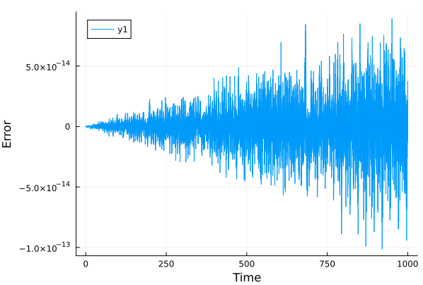

From this, it seems that the error increases linearly with time, and even after a significant amount of time (many periods), the error is still on the order of $10^{-14}$.

With normal ITensorNetworks, doing the same thing with tree tensor networks gives the following plot. The difference isn't noteable.

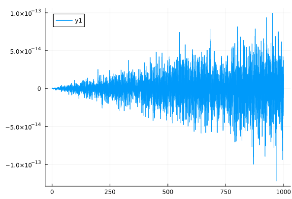

The difference between the two methods is plotted here:

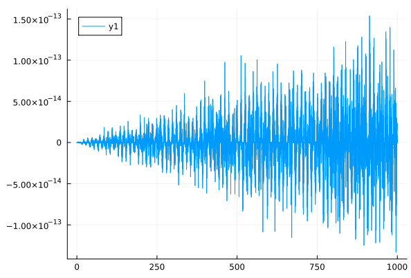

When doing this for a larger system ()